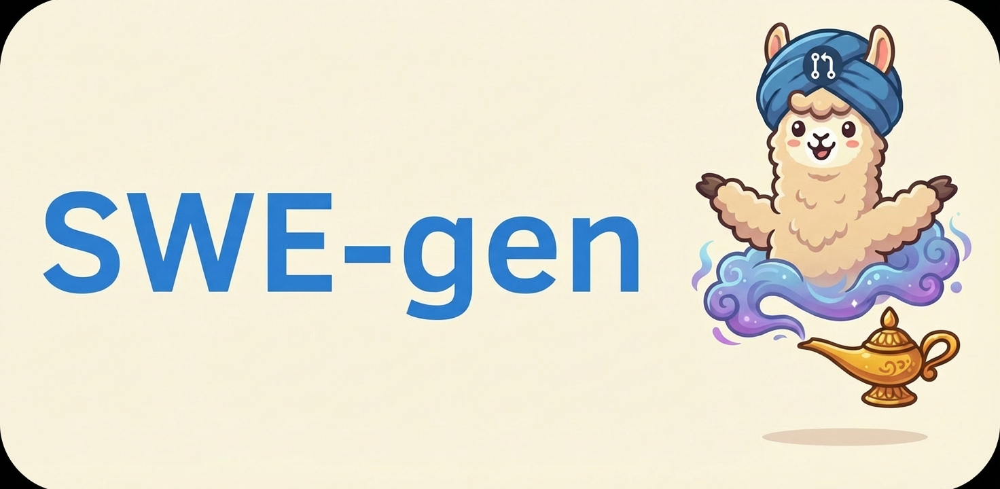
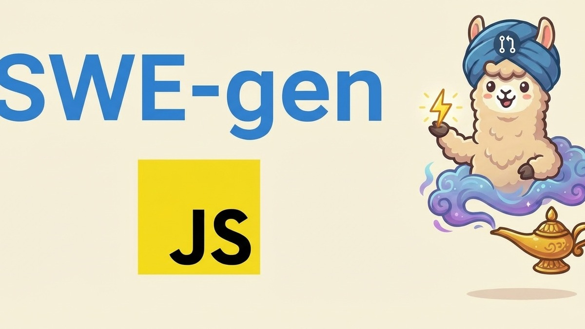
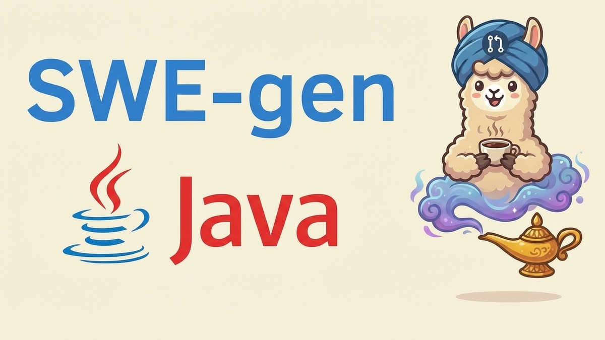
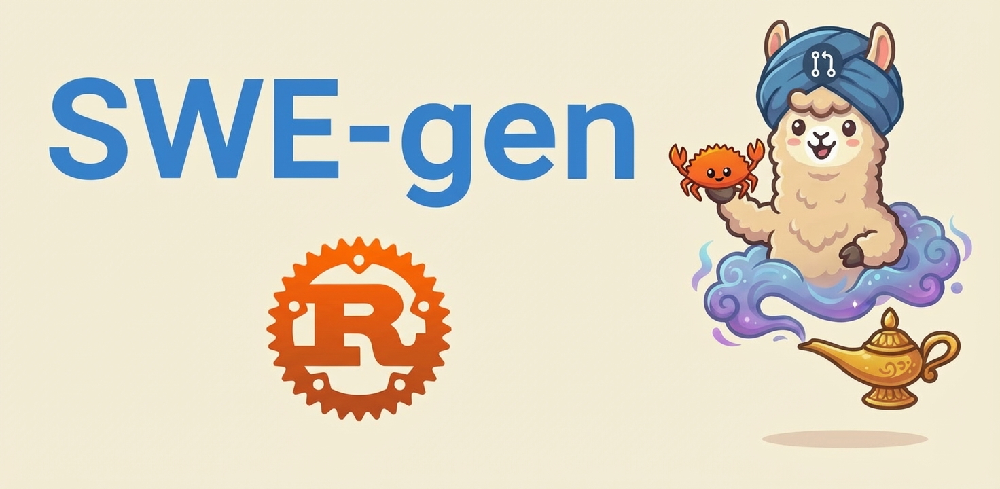
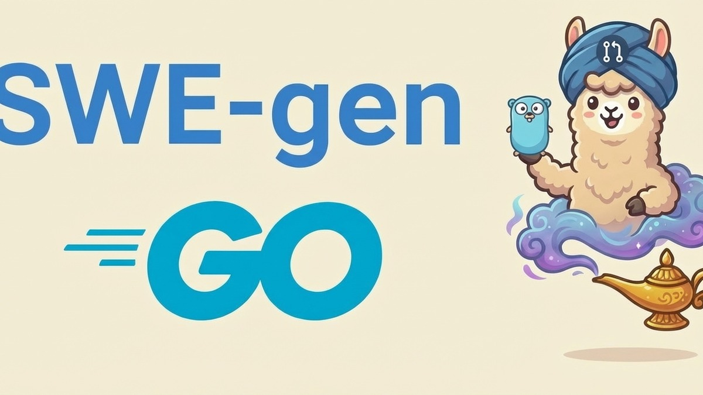
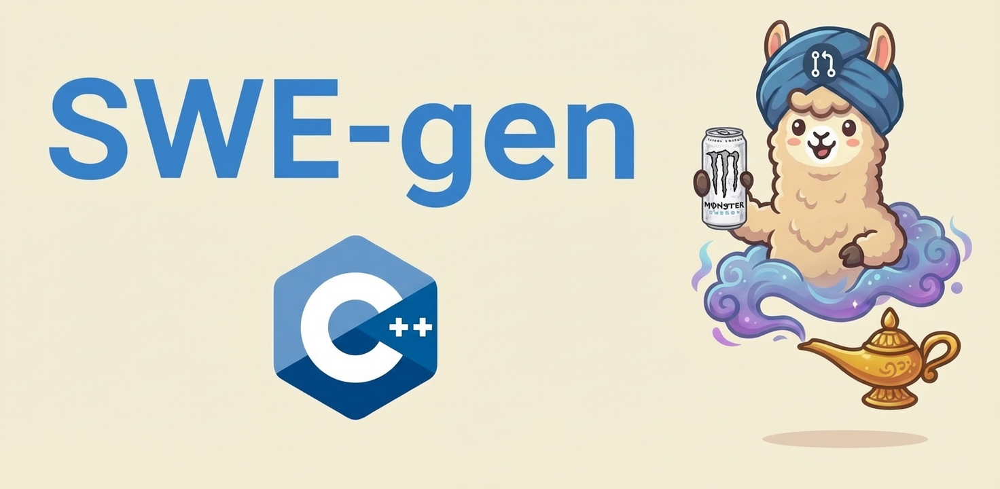
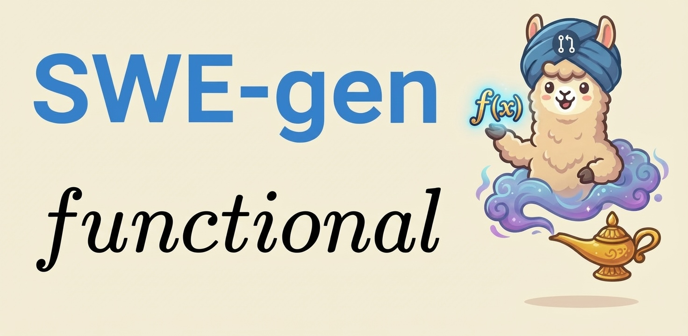

<p align="center">
  <a href="https://github.com/abundant-ai/swe-gen">
    
  </a>
</p>

<p align="center">
  <a href="https://www.python.org/downloads/">
    
  </a>
  <a href="https://opensource.org/licenses/Apache-2.0">
    
  </a>
  <a href="https://pypi.org/project/swegen/">
    
  </a>
</p>

# SWE-gen

> Convert merged GitHub PRs into [Harbor](https://github.com/laude-institute/harbor) tasks automatically.

## Overview

Automates task creation from real bug fixes in open-source GitHub repos. Works with **any programming language**: Claude Code analyzes the repo to detect language, build system, and test framework.

Each task reverses a merged PR to recreate the buggy state, verifies tests fail on baseline, and pass after applying the fix. Fully containerized with all dependencies installed at build time.

## News
<!-- - [03/2026] 🤓 **[SWE-gen-fn](https://github.com/abundant-ai/SWE-gen-fn)**: 1,000 functional programming tasks! -->
<!-- - [03/2026] 🔋 **[SWE-gen-Cpp](https://github.com/abundant-ai/SWE-gen-Cpp)**: 1,000 C++ tasks! -->
- [02/2026] 1000 🦀 **[SWE-gen-Rust](https://github.com/abundant-ai/SWE-gen-Rust)** and 🦫 **[SWE-gen-Go](https://github.com/abundant-ai/SWE-gen-Go)** tasks!
- [02/2026] ☕ **[SWE-gen-Java](https://github.com/abundant-ai/SWE-gen-Java)**: 1,000 JVM tasks!
- [01/2026] 🔥 **[SWE-gen-JS](https://github.com/abundant-ai/SWE-gen-JS)** released: 1,000 JS/TS task dataset generated with SWE-gen

## Quick Start

```bash
# Install
uv pip install swegen

# Generate a task from a merged PR
swegen create --repo axios/axios --pr 7150

# Or farm all PRs from a repo
swegen farm fastapi/fastapi
```

## Installation

```bash
uv pip install swegen
```

Ensure these environment variables are set:

```bash
export GITHUB_TOKEN=<gh-token>
export OPENAI_API_KEY=<api-key>
export ANTHROPIC_API_KEY=<api-key>  # or CLAUDE_CODE_OAUTH_TOKEN
```

**Note:** Cloud sandbox environments (Daytona, E2B, Modal, etc.) require additional API keys.

## Usage

**Commands:**
- `swegen create` — Generate a task from a merged PR
- `swegen farm` — Continuously process PRs from a repository
- `swegen validate` — Validate existing task (NOP + Oracle)
- `swegen analyze` — Deep analysis with agent trials to verify task quality

### Generate a Task

```bash
swegen create --repo <owner/repo> --pr <num>
```

<details>
<summary>Options</summary>

- `--output PATH` — Output directory for generated tasks (default: `tasks`)
- `--state-dir PATH` — State directory for cache/logs (default: `.swegen`)
- `--cc-timeout N` — Claude Code session timeout in seconds (default: 3200)
- `--env, -e TYPE` — Environment type: `docker`, `daytona`, `e2b`, `modal`, `runloop`, `gke` (default: `docker`)
- `--no-validate` — Skip Harbor validations
- `--force` — Bypass local dedupe and regenerate
- `--no-cache` — Disable cached artifacts from previous tasks
- `--no-require-minimum-difficulty` — Skip 3+ file and LLM substantiality checks
- `--min-source-files N` — Minimum number of source files required (default: 3, tests excluded)
- `--max-source-files N` — Maximum number of source files to avoid large refactors (default: 10, tests excluded)
- `--no-require-issue` — Allow PRs without linked issues (uses PR body/title for instructions)
- `-v, --verbose` / `-q, --quiet`

</details>

### Continuous PR Farming

Stream through entire PR history, process each sequentially with state persistence.

```bash
swegen farm fastapi/fastapi
```

<details>
<summary>Options</summary>

- `--output PATH` — Output directory for generated tasks (default: `tasks`)
- `--state-dir PATH` — State directory for cache/logs (default: `.swegen`)
- `--timeout N` — Timeout per PR in seconds (default: 300)
- `--cc-timeout N` — Claude Code session timeout (default: 3200)
- `--task-delay N` — Delay between tasks in seconds (default: 60)
- `--api-delay N` — Delay between GitHub API calls in seconds (default: 0.5)
- `--env, -e TYPE` — Environment type: `docker`, `daytona`, `e2b`, `modal`, `runloop`, `gke` (default: `docker`)
- `--resume-from DATE` — Resume from date or timestamp
- `--reset` — Reset state and start from beginning
- `--dry-run` — Preview without generation
- `--force` — Regenerate even if task already exists (default: true)
- `--no-validate` — Skip Harbor validation step
- `--require-issue` / `--no-require-issue` — Require PRs to have linked issues (default: True)
- `--no-require-minimum-difficulty` — Skip 3+ file and LLM checks
- `--min-source-files N` — Minimum number of source files required (default: 3, tests excluded)
- `--max-source-files N` — Maximum number of source files to avoid large refactors (default: 10, tests excluded)
- `--no-cache` — Disable cached artifacts
- `--docker-prune-batch N` — Run docker cleanup after every N PRs (default: 5, 0 to disable)
- `--skip-list PATH` — Path to file with task IDs to skip (one per line)
- `-v, --verbose`

</details>

### Validate Existing Tasks

Verify that a task passes NOP (baseline fails) and Oracle (solution succeeds) agents:

```bash
swegen validate <task_id>
```

### Analyze Task Quality

Run agent trials to verify a task is well-specified and solvable:

```bash
swegen analyze <task_id>
```

<details>
<summary>What analyze does</summary>

1. Static quality check (`harbor tasks check`)
2. Baseline validation (nop fails, oracle passes)
3. Run N agent trials
4. Trial classification (identifies TASK vs AGENT problems)
5. Task verdict synthesis with actionable recommendations

**Classification categories:**
- `GOOD_SUCCESS` — Agent solved it correctly
- `BAD_SUCCESS` — Agent cheated or tests too permissive
- `GOOD_FAILURE` — Agent failed due to its own limitations
- `BAD_FAILURE` — Agent failed due to task issues (underspecified, brittle tests, etc.)
- `HARNESS_ERROR` — Infrastructure problem

</details>

## Task Requirements

<details>
<summary>Valid PR criteria</summary>

**Languages:** Any (Python, JavaScript, TypeScript, Go, Rust, Ruby, Java, etc.)

**Valid PRs must:**
- Be merged to primary branch with accessible fork
- Include test changes and corresponding fix
- Have a linked issue for high-quality instructions (bypass with `--no-require-issue`)
- Modify 3-10 source files (configurable with `--min-source-files` and `--max-source-files`, bypass with `--no-require-minimum-difficulty`)
- Pass LLM substantiality evaluation (bypass with `--no-require-minimum-difficulty`)
- Fail tests on reversed baseline, pass after applying fix
- Exclude documentation-only, formatting-only, or version-bump-only changes

</details>

## How It Works

<details>
<summary>Pipeline details</summary>

The pipeline uses a **language-agnostic approach**:

1. **Fetch & Analyze** — Get PR metadata via GitHub API, clone repo, identify test files
2. **Evaluate** — LLM evaluates PR substantiality and generates task instructions
3. **Generate Skeleton** — Create Dockerfile and test.sh with TODOs for Claude Code
4. **Claude Code Completion** — CC analyzes repo, detects language/runtime/build system, fills in skeleton
5. **Validation** — Run NOP (reward=0) and Oracle (reward=1) agents
6. **Iteration** — CC iterates until both agents pass

**Key Details:**
- Dockerfile clones at HEAD, then applies `bug.patch` to revert to buggy BASE state
- Test files stored in `task/tests/` and copied at runtime (prevents agent tampering)
- `fix.patch` (solution) excludes tests/CI, contains all other PR changes
- Dependencies installed at build time; runtime doesn't require internet access
- Successful tasks are cached as references to speed up future tasks from the same repo
- PR evaluation uses LLM to check substantiality and generate instructions

</details>

## Datasets

<p>
  <a href="https://github.com/abundant-ai/SWE-gen-JS">
    
  </a>&nbsp;&nbsp;
  <a href="https://github.com/abundant-ai/SWE-gen-Java">
    
  </a>
</p>
<p>
  <a href="https://github.com/abundant-ai/SWE-gen-Rust">
    
  </a>&nbsp;&nbsp;
  <a href="https://github.com/abundant-ai/SWE-gen-Go">
    
  </a>
</p>
<p>
  <a href="https://github.com/abundant-ai/SWE-gen-Cpp">
    
  </a>&nbsp;&nbsp;
  <a href="https://github.com/abundant-ai/SWE-gen-FN">
    
  </a>
</p>

## License

[Apache License 2.0](LICENSE)
